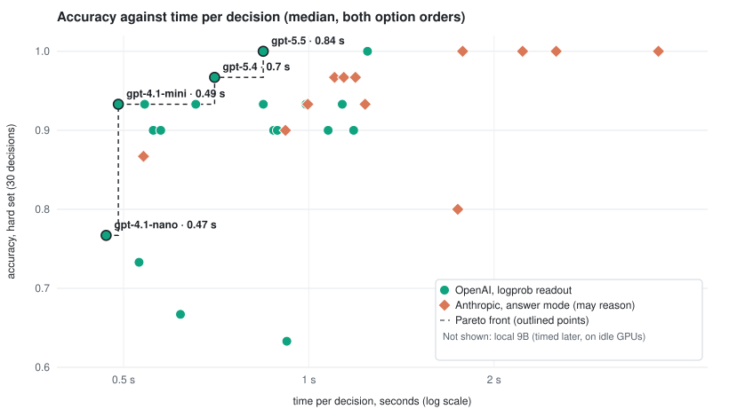
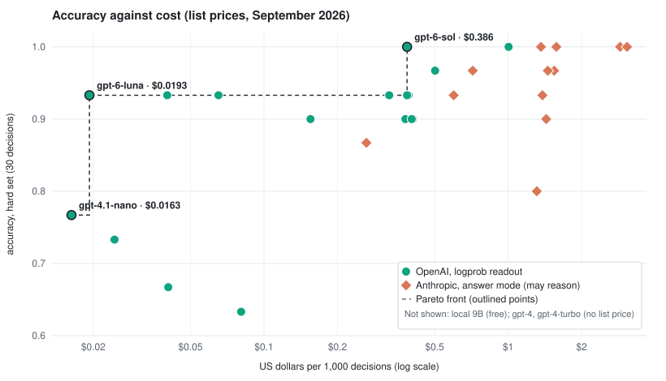

# jevless

**Jev-style typed decisions from any model whose API exposes log-probabilities.**

An agent makes lots of small decisions: route this ticket, is this memory relevant, did that step succeed, how urgent is this. Asking a model to *write* "yes" and parsing it is slow and gives no probability. jevless asks the question once and reads the probabilities of the answer letters at the first output position. That's one prefill and one token, and you get a probability for every option.

It implements the three decision primitives popularised by TypeSafe's hosted **Jev** "System One" model:
- **Choice:** pick one of several options.
- **Noul:** how likely a statement is true.
- **Score:** a level on an ordered scale.

It includes a local server that speaks the same `/v1/systemone` request shape, but runs on models you choose: a local 9B in LM Studio, vLLM, llama.cpp, or OpenAI's API.

> Not affiliated with TypeSafe. "Jev" is their product; jevless is an independent, open implementation of the same idea over ordinary model APIs.

## Results: 31 hosted models and a local 9B, one decision at a time

The same 60 labelled decisions, 30 in the `basic` set and 30 in the `hard` set ([below](#comparing-models)), put to every model two API keys could reach on 25 September 2026, using jevless v0.4. A decision reads both option orders, sent in parallel. **Time** is the median per decision from this machine, network included. **Cost** is from the measured tokens at each provider's list price ([OpenAI](https://developers.openai.com/api/docs/pricing), [Anthropic](https://platform.claude.com/docs/en/about-claude/pricing), read the same day).

**Fastest decisions:**

| Model | Time per decision | Hard set | Cost per 1,000 decisions |
|---|---|---|---|
| Qwen3.5-9B Q4, local (LM Studio, 2× RTX 3090) | **0.46 s** | 0.87 | free |
| gpt-4.1-nano | **0.47 s** | 0.77 | $0.016 |
| gpt-4.1-mini | **0.49 s** | 0.93 | $0.065 |
| gpt-4o-mini | 0.53 s | 0.73 | $0.024 |
| claude-haiku-4-5 (answer mode) | 0.54 s | 0.87 | $0.26 |
| gpt-4.1 | 0.54 s | 0.93 | $0.33 |
| gpt-5.4-mini | 0.56 s | 0.90 | $0.16 |

**gpt-4.1-mini is the hosted sweet spot:** 0.93 on the hard set, the fastest hosted decision after gpt-4.1-nano, and 6.5 cents per thousand. **A local 9B is as fast and free,** at 0.87. For the last few points: gpt-5.4 (0.97 at 0.70 s, 50 cents per thousand) and gpt-5.5 (1.00 at 0.84 s, $1.00). By cost alone: gpt-6-luna (0.93 at 1.9 cents per thousand, but 0.99 s) and gpt-6-sol (1.00 at 39 cents).

<p align="center"></p>
<p align="center"></p>

The **Pareto front** is the set of models that no other model beats on both axes at once: at least as accurate, and at least as fast or as cheap.

| Model | Provider | How it decides | Basic | Hard | Time per decision | Tokens in / out | Cost per 1,000 decisions |
|---|---|---|---|---|---|---|---|
| gpt-5.5 | OpenAI | readout, reasoning off | 1.00 | **1.00** | 0.84 s | 153 / 8 | $1.00 |
| gpt-6-sol | OpenAI | readout, reasoning off | 1.00 | **1.00** | 1.25 s | 153 / 8 | $0.39 |
| claude-opus-4-6 | Anthropic | answer (may reason) | 1.00 | **1.00** | 1.78 s | 172 / 20 | $1.36 |
| claude-opus-5-5 | Anthropic | answer (may reason) | 1.00 | **1.00** | 2.23 s | 230 / 33 | $1.58 |
| claude-fable-5 | Anthropic | answer (may reason) | 1.00 | **1.00** | 2.52 s | 226 / 12 | $2.88 |
| claude-fable-5-1 | Anthropic | answer (may reason) | 1.00 | **1.00** | 3.70 s | 230 / 15 | $3.07 |
| gpt-5.4 | OpenAI | readout, reasoning off | 1.00 | **0.97** | 0.70 s | 153 / 8 | $0.50 |
| claude-sonnet-4-6 | Anthropic | answer (may reason) | 1.00 | **0.97** | 1.10 s | 172 / 13 | $0.72 |
| claude-sonnet-4-5 | Anthropic | answer (may reason) | 1.00 | **0.97** | 1.14 s | 172 / 68 | $1.54 |
| claude-opus-4-5 | Anthropic | answer (may reason) | 1.00 | **0.97** | 1.19 s | 172 / 24 | $1.45 |
| gpt-4.1-mini | OpenAI | readout | 1.00 | **0.93** | 0.49 s | 155 / 2 | $0.065 |
| gpt-4.1 | OpenAI | readout | 1.00 | **0.93** | 0.54 s | 155 / 2 | $0.33 |
| gpt-5.1 | OpenAI | readout, reasoning off | 1.00 | **0.93** | 0.66 s | 153 / 20 | $0.39 |
| gpt-5.6-luna | OpenAI | readout, reasoning off | 0.97 | **0.93** | 0.84 s | 153 / 8 | $0.040 |
| gpt-6-luna | OpenAI | readout, reasoning off | 1.00 | **0.93** | 0.99 s | 153 / 8 | $0.019 |
| claude-opus-4-8 | Anthropic | answer (may reason) | 1.00 | **0.93** | 1.00 s | 226 / 10 | $1.38 |
| gpt-5.6-sol | OpenAI | readout, reasoning off | 1.00 | **0.93** | 1.13 s | 153 / 8 | $0.39 |
| claude-sonnet-5 | Anthropic | answer (may reason) | 1.00 | **0.93** | 1.23 s | 226 / 15 | $0.60 |
| gpt-5.4-mini | OpenAI | readout, reasoning off | 1.00 | **0.90** | 0.56 s | 153 / 9 | $0.16 |
| gpt-4o | OpenAI | readout | 1.00 | **0.90** | 0.57 s | 155 / 2 | $0.41 |
| gpt-4 | OpenAI | readout | 1.00 | **0.90** | 0.88 s | 155 / 2 | not listed |
| gpt-5.2 | OpenAI | readout, reasoning off | 1.00 | **0.90** | 0.89 s | 153 / 8 | $0.38 |
| claude-opus-4-7 | Anthropic | answer (may reason) | 1.00 | **0.90** | 0.92 s | 236 / 10 | $1.43 |
| gpt-5.6-terra | OpenAI | readout, reasoning off | 1.00 | **0.90** | 1.08 s | 153 / 8 | $0.40 |
| gpt-4-turbo | OpenAI | readout | 1.00 | **0.90** | 1.18 s | 155 / 2 | not listed |
| Qwen3.5-9B Q4 (this machine) | local | readout | 0.93 | **0.87** | 0.46 s | 178 / 2 | free (local) |
| claude-haiku-4-5 | Anthropic | answer (may reason) | 0.97 | **0.87** | 0.54 s | 172 / 18 | $0.26 |
| claude-opus-5 ¹ | Anthropic | answer (may reason) | 0.93 | **0.80** | 1.75 s | 225 / 7 | $1.31 |
| gpt-4.1-nano | OpenAI | readout | 0.93 | **0.77** | 0.47 s | 155 / 2 | $0.016 |
| gpt-4o-mini | OpenAI | readout | 1.00 | **0.73** | 0.53 s | 155 / 2 | $0.024 |
| gpt-5.4-nano | OpenAI | readout, reasoning off | 0.90 | **0.67** | 0.62 s | 153 / 8 | $0.041 |
| gpt-3.5-turbo | OpenAI | readout | 0.87 | **0.63** | 0.92 s | 155 / 2 | $0.081 |

¹ claude-opus-5 left 5 of its 60 replies without an answer letter (empty, or reasoning written out as text). They count as wrong.
The local 9B was timed with one decision in flight on idle GPUs, which is what a single user sees. The hosted models ran four at a time, which a hosted API absorbs without slowing down. With its two option orders sent one after the other, the 9B takes 0.52 s.

**How to read it:**
- **Two ways of deciding.** *Readout* models answer in one token, and jevless reads the probability of every option; that is what jevless is for. Claude models have no logprobs API, so they run in *answer* mode: the model replies and jevless takes the letter.
  - claude-opus-5-5, claude-fable-5 and claude-fable-5-1 can't switch thinking off, so they ran with adaptive thinking at low effort. The others ran with thinking disabled, though some still work through a hard item in the reply itself.
  - Reasoning helps on the hard set and costs time and output tokens. Compare accuracy within a mode; time and cost compare across them.
- **Tokens:**
  - Input is about 155 tokens a decision: two orders of about 77 each.
  - Output is 2 for the classic OpenAI models, one per order. GPT-5.x models add a few hidden tokens (8 in total; 20 for gpt-5.1), and Claude's output includes any reasoning.
  - A streamed Claude reply cut short at its letter has its output estimated from the text received.
- **Run to run,** accuracy moves by a question or two: OpenAI's logprobs are not perfectly deterministic. The v0.3 run of this table gave gpt-3.5-turbo 0.67 on the hard set; this one gives 0.63.
- **Scale.** Thirty items per set: fine for comparing models on the same footing, not a benchmark result. `python scripts/plot_results.py results/models-2026-09-25.json docs/` redraws the charts from the data.

## Making decisions fast

Measured from this machine on 25 September 2026, median per decision on the basic set:

| Model | Orders one after the other (v0.3) | Orders in parallel | + connections kept alive (v0.4) |
|---|---|---|---|
| gpt-4.1-mini | 1,068 ms | 581 ms | **518 ms** |
| gpt-5.4-mini | 1,125 ms | 593 ms | **545 ms** |
| gpt-4.1 | 1,166 ms | 604 ms | **564 ms** |
| claude-haiku-4-5 (answer mode, streamed) | 1,004 ms | 561 ms | **531 ms** |
| claude-sonnet-4-6 (answer mode, streamed) | 1,933 ms | 1,042 ms | about 1,050 ms |

**Where the time goes.** For gpt-4.1-mini, a request takes about 430 ms. The server's own processing (`openai-processing-ms`) is 360 ms of that, and a fresh TCP and TLS handshake is 61 ms. With a hosted API, one round trip per decision is the floor, and most of it is the provider's.

**What v0.4 does:**
- **Both option orders at once.** The two readings don't depend on each other, so they go out together. This halves the time per decision at no cost. `--sequential-orders` turns it off, for a local server with one slot where parallel requests would only queue.
- **Connections kept alive.** One per thread and host, on long-lived threads, which saves the handshake on every request after the first.
- **Streaming in answer mode.** Claude Haiku writes its letter at about 400 ms and keeps explaining until about 700 ms. jevless reads the stream and stops at the letter, which saves time and output tokens.

**Available but not the default:**
- **Adaptive second order** (`--orders auto`, or `Decider(permutations="auto")`). Read one order, and read the reversed one only when the first reading's top option is below `auto_threshold` (default 0.9). Measured on six OpenAI models, both sets:

  | Model | Both orders: hard, tokens in, log loss | Adaptive: hard, tokens in, log loss | Second order needed |
  |---|---|---|---|
  | gpt-4.1-mini | 0.93, 155, 0.19 | 0.93, 80, 0.51 | 3% |
  | gpt-4.1 | 0.93, 155, 0.11 | 0.93, 77, 0.24 | 0% |
  | gpt-5.4 | 0.97, 153, 0.06 | 0.97, 79, 0.08 | 3% |
  | gpt-5.4-mini | 0.90, 153, 0.17 | 0.90, 84, 0.18 | 10% |
  | gpt-4o-mini | 0.73, 155, 1.01 | 0.77, 81, 1.15 | 5% |
  | gpt-4.1-nano | 0.77, 155, 0.72 | 0.77, 84, 1.16 | 8% |

  Accuracy stayed the same (one item better on gpt-4o-mini), input tokens halved, and decisions were 5–15% faster, since nothing waits on the slower of two requests. **Calibration got worse:** a model that is confidently wrong in one order is no longer tempered by the other, and the flip signal is gone for confident decisions. Raising the threshold to 0.99 barely helped: these models are over 99% sure on most first readings, including wrong ones. Use `auto` when you need the choice and care about cost. Keep both orders when you threshold or calibrate the probabilities.
- **Priority processing** (`--extra-body '{"service_tier": "priority"}'` on OpenAI): 429 → 390 ms per request for gpt-4.1-mini, 518 → 493 ms for gpt-5.4-mini, at a higher price.
- **One order** (`--orders 1`): half the tokens and no protection against position bias. `auto` is the same saving with a check on unsure decisions.

**Not faster:**
- **Shorter prompts.** On the bench items, jevless's own wording is 46 of a median 70 tokens; on a real state of a few hundred tokens it is under a tenth. Prefill is a sliver of the server's 360 ms, so trimming saves money, not time, and it costs accuracy. A lean version (no section labels or instruction line, bare `true`/`false`, levels without `level N:`) was 40% shorter, 105 against 155 billed tokens per decision. It scored lower on all three models tried: gpt-4.1-mini 0.967 → 0.917, gpt-5.4-mini 0.967 → 0.950, gpt-4.1-nano 0.850 → 0.833. The items it lost were the reasoning ones (a discount, a leap-year date, unit prices), and every lost true/false item flipped to "true". So the spelled-out wording stays.
- **Streaming a readout.** The answer is the first token, so it arrives with the whole response. GPT-5.x adds only a few hidden tokens (462 ms to the answer against 469 ms for the whole reply).

**Not built yet:**
- **Packing questions.** Several questions about one state in one request, with a readout at each answer position. The state is sent once, which saves tokens and requests against rate limits. Later answers would see the earlier ones, so this needs measuring first.
- **Prompt caching for long states.** OpenAI caches prompts of 1,024 tokens or more on its own (jevless already puts the state first); Anthropic needs `cache_control`. This matters for long states such as a memory gate over several recalled passages.
- **A decision cache.** The same state and question should not be asked twice.
- **A faster local setup.** On this machine, LM Studio splits the 9B across both GPUs. Pinned to one GPU under llama-server, it generated about 35% faster in an earlier throughput test; its decision time hasn't been measured yet. A cached state (the same state asked several questions) cuts one request to 0.11–0.15 s.

## Quick start

```python
from jevless import Decider, LMStudio, OpenAIChat

decide = Decider(LMStudio("qwen/qwen3.5-9b"))                 # or OpenAIChat("gpt-4.1-mini", api_key=...)

decide.noul("The API has returned 503 since the deploy.", "This is an outage.").noul          # 0.956
a = decide.choice("A customer writes: my card was charged twice.", "Which team should handle this?",
                  {"billing": None, "shipping": None, "security": None})
a.choice, a.probabilities, a.confidence, a.flip           # 'billing', {...}, 0.989, False
decide.score("Our checkout page has been down for all customers for the last hour.", "How urgent is this?",
             ["can wait", "this week", "today", "right now"]).score                    # 3.0 ("right now")

decide.many(state, {"urgent": Noul("..."), "team": Choice("...", {...})})    # several questions, in parallel
```

Or as a service:

```bash
pip install git+https://github.com/jbpayton/jevless
jevless probe --backend lmstudio --model qwen/qwen3.5-9b      # sanity-check a model before relying on it
jevless bench --model gpt-4.1-mini --set hard                  # labelled decisions; key from $OPENAI_API_KEY
jevless serve --backend lmstudio --model qwen/qwen3.5-9b --port 8765

curl -s localhost:8765/v1/systemone -d '{
  "state": "A customer writes: my card was charged twice.",
  "questions": {
    "urgent": {"type": "noul", "instructions": "This needs a reply today."},
    "team":   {"type": "choice", "instructions": "Which team?", "criteria": {"billing": null, "shipping": null}},
    "tone":   {"type": "score", "instructions": "How upset is the customer?", "criteria": ["calm", "annoyed", "angry"]}}}'
```

The response has the same shape as Jev's: `{model, answers: {id: {type, noul | choice, probabilities, confidence | score, legend}}, usage}`. jevless adds `flip`.

(The numbers shown are from Qwen3.5-9B in LM Studio, as the model loaded there as `qwen35-9b`. The examples in `examples/` read the model name from `JEVLESS_MODEL`.)

## Any OpenAI-compatible endpoint

Point `--url` at the server and name the environment variable that holds the key:

```bash
export MY_LLM_KEY=...                                   # or whatever your system already sets
jevless probe --url https://llm.example.com/v1 --model my-model --api-key-env MY_LLM_KEY
jevless bench --url https://llm.example.com/v1 --model my-model --api-key-env MY_LLM_KEY
```

- **`--url`** can be the server root, a base URL ending in `/v1`, or a full `.../chat/completions` URL with its query string (Azure). It defaults to `$OPENAI_BASE_URL`, then `https://api.openai.com`.
- **The key** is read from `--api-key-env` (default `OPENAI_API_KEY`). `--api-key` also works, but anyone on the machine can see it in the process list.
- **`--key-header api-key`** sends the bare key in that header instead of `Authorization: Bearer` (Azure). `--header 'Name: value'` adds any other header.
- **Newer OpenAI models** that refuse `max_tokens` are retried with `max_completion_tokens` automatically.
- **Reasoning models** need reasoning off before they return logprobs: `--reasoning-effort none` for OpenAI's GPT-5.1 and later (set automatically when refused), `--thinking off` on vLLM or llama-server. Some never return them (OpenAI's o-series, gpt-5, gpt-5-mini, gpt-5-nano).

## Comparing models

`jevless bench` runs hand-written, labelled decisions (noul, choice and score) and reports accuracy, log loss, Brier score, how often the two option orders disagree, and latency, then lists every miss.
- **`--set basic`** (the default): 30 everyday decisions with a few traps (negation, sarcasm, a memory about the wrong person, a reply with nothing behind it, Winograd pronouns). Frontier models get all of it right.
- **`--set hard`**: 30 more, harder for a model that has to answer in one token with no reasoning. They include arithmetic, a leap-year due date, stacked negation, "all except", log lines out of order, a web page with a hidden instruction, units, a syllogism with a false premise, a code trace, a false-belief question, a notice deadline, and a right answer shown as option 7 of 8.
- **`--file`** takes your own decisions as JSONL (the format is in `jevless/bench.py`); `--out` saves every decision.

Results are [at the top](#results-31-hosted-models-and-a-local-9b-one-decision-at-a-time). Notes on running them:

- **Which OpenAI models work.** The GPT-3.5, GPT-4, GPT-4o and GPT-4.1 families return logprobs as they are. GPT-5.1 and later (including gpt-6-luna and gpt-6-sol) return them only with reasoning off, which jevless sets on its own. gpt-5, gpt-5-mini, gpt-5-nano, the o-series and gpt-6-astra refuse logprobs; the `-chat-latest` aliases are retired.
- **Adapting to newer models.** jevless reads each refusal and adjusts once: `max_completion_tokens` instead of `max_tokens`, with room for a few hidden tokens; `top_logprobs` capped at 5; no `temperature`; reasoning off. The Anthropic backend does the same for `temperature` and thinking.
- **Log loss for gpt-5.2 and later has a floor.** These models list only alternatives with real probability, so an option they leave out gets jevless's floor. That caps how confident a readout can look, so their log loss can't go much below about 0.01. Their accuracy is exact. Answer-mode backends report no log loss at all.
- **What the hard set exposes.** Among readout models, the notice-deadline item ("renews unless cancelled at least 30 days before October 1; cancelled September 5") was missed by 17 of 20. Unit prices, distinct names on a sign-in sheet and the leap-year date each caught several. These are the decisions to hand to a reasoning step rather than a one-token readout.
- **One judgment call.** Whether "password reset emails aren't being sent" is *major* or *critical* splits older models (critical) from newer ones (major, the label here).

A small local model, for contrast: Qwen3.5-0.8B through llama-server scored 0.50 on the basic set. It answers "true" to nearly every false statement, which is what `probe` is there to catch.

## How it works

1. **The prompt.** The state goes first, then the question, then the options as single letters: `A) billing`, `B) shipping`… With the state first, servers with prefix caching reuse it across a fan-out of questions.
2. **The readout.** The model makes one forward pass. jevless reads the log-probabilities of the option letters at the first output position and renormalises over the letters on offer.
3. **Both orders.** By default the options are also read in reverse order and the two readings are averaged, which cancels the model's preference for an option's *position*. `flip` is true when the two readings disagree: a cheap "look closer" signal.
4. **Calibration.** Raw probabilities are uncalibrated. Log decisions (`Decider(..., log=callback)`), record what turned out to be right, and fit a temperature per question type (`fit_temperature`) once you have about 50 labels.

## Backends

| Backend | Works with | Notes |
|---|---|---|
| `OpenAIChat` | OpenAI (non-reasoning chat models), vLLM, llama.cpp's llama-server, SGLang, other OpenAI-compatible servers that return `logprobs` | `thinking="off"` disables Qwen3-style thinking on vLLM or llama-server. The top-k window is at most 20 |
| `LMStudio` | LM Studio | Its chat endpoint returns no logprobs; `/v1/responses` does, with reasoning switched off |
| `LlamaCpp` | llama.cpp's native `/completion` | Raw prompt, so pass the model's chat template |
| `Transformers` | Any local Hugging Face causal LM | In-process logits. Needs `torch` and `transformers` |
| `Anthropic` | Claude models | No logprobs: answer mode (the model's letter, no probabilities). Thinking off where allowed, else lowest effort |

**No logprobs, answers only:** Anthropic's API returns no log-probabilities. `--backend anthropic` (key from `$ANTHROPIC_API_KEY`) still runs decisions in *answer* mode: the model replies, jevless takes the letter, and there are no probabilities or calibration.

## What it's good for, measured

These numbers come from building [hermes-sophia](https://github.com/jbpayton/hermes-sophia), a memory system that uses this technique for all its decisions. They were measured on one machine (2× RTX 3090, LM Studio). The research scripts and data are in that repo.

- **Decisions that similarity can't make.** Deciding whether recalled memories actually answer a question: cosine similarity couldn't separate answers from near-misses (0.80 against 0.78). A Qwen3.5-9B readout got 32 of 34 right, and never missed an answer that was there.
- **Navigation.** On room-by-room choices in a memory graph ("which door leads to the answer?"), the 9B and a 27B readout got every choice right. Small purpose-built decision encoders (Laya 421M, Von 395M) were fast but wrong without fine-tuning.
- **Speed.** One question on the 9B takes 210–640 ms cold (depending on state length) and 110–150 ms with the state cached. Eight in flight gave 6.6 decisions per second.
- **Wording and both orders matter.**
  - Checking whether a reply invented facts: one negatively worded question in one order didn't separate true from false cases at all. A positive wording read in both orders did (0.59+ against 0.34 or less).
  - Deciding whether a new fact replaces an old one: false cases topped out at 0.74 and real changes started at 0.92. The fix was the threshold, not the model.
  - So measure on a few labelled cases before trusting a threshold.
- **Model size matters.** A Qwen3.5-0.8B waved an off-topic question through a relevance check at 0.90, where the 9B said 0.45. `jevless probe` catches this kind of model before you rely on it.

## Limits

jevless is a thin approximation of Jev: an ordinary model and a readout, with no purpose-trained decision head and no calibration out of the box. For routing, gating and triage with a decent model that is often good enough. At worst, it shows how the technique works in about 500 lines of Python.

- **Up to 26 options per question** (single letters); Jev allows 255.
- **Probabilities are uncalibrated** until you fit temperatures from your own labelled decisions.
- **Reading both orders doubles the calls.** Use `permutations=1` when speed matters more than position bias.
- **The model must answer immediately:** switch reasoning or thinking off.

## Related work

- **TypeSafe's Jev:** hosted, proprietary, and the origin of the Choice / Noul / Score framing and the wire format.
- **Open readout projects:** jobe, reflex and SemIf read decisions from frozen open models in-process. jevless applies the same idea over the HTTP APIs of whatever server you already run.

## License

MIT
